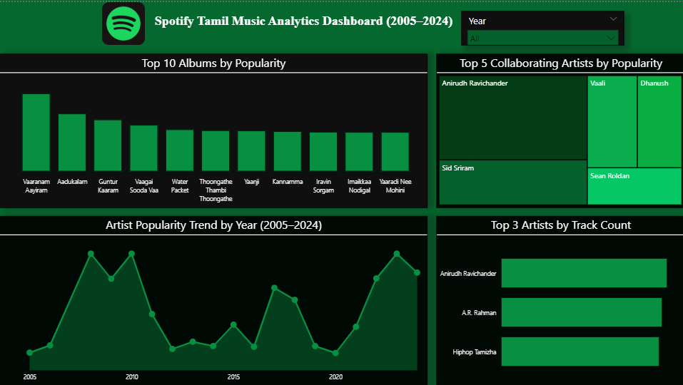

# Spotify Music Analytics Dashboard (Power BI)

## Overview
This project analyzes Spotify Tamil music data (2005–2024) to understand artist popularity, album trends, and collaborations.

## Tools Used
- Power BI

## Project Preview

## Key Analysis
- Top albums by popularity
- Artist collaboration analysis
- Artist popularity trends over time
- Top artists by track count

## Key Insights
- Certain artists dominate across multiple years
- Collaborations contribute significantly to popularity
- Music trends show variation over time
- Top artists consistently produce high-performing tracks

## Features
- Interactive dashboard with year filter
- Trend analysis and ranking visuals

## Project Files
- spotify-dashboard.pbix
- spotify-dashboard.png
